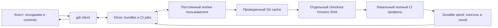

# Архитектура gdi 0.3: автономный агент и host CI

Реализованы Git protocol v2 и CI protocol v1. Обычный обмен работает без worker;
автономный CI требует один раз настроенного host. Python 3.10.12, стандартная
библиотека, внешние Git/rclone. Человеческий workflow: [QUICKSTART.md](QUICKSTART.md),
инструкция агенту: [GOOGLE_DRIVE_CI_PUBLISHING_WORKFLOW.md](GOOGLE_DRIVE_CI_PUBLISHING_WORKFLOW.md).

## Поток данных



Агент отправляет один или несколько commits, worker проверяет выбранный HEAD,
агент видит этапы/heartbeat и stdout+stderr, получает проверенный FAIL/PASS,
исправляет код новым commit и повторяет цикл. Рабочий каталог пользователя не
меняется; получение проверенной версии — отдельный `pull --passed --job`.

## Компоненты

| Модуль | Ответственность |
| --- | --- |
| `exchange.py`, `cache.py`, `git.py` | Git metadata chains, full/delta bundles, quarantine, cache, fast-forward |
| `transport.py` | rclone: immutable artifacts, ограниченные mutable snapshots, scoped deletion |
| `ci_protocol.py` | CI request/result schemas, identities, canonical JSON, checksums, durable writes |
| `ci.py` | Durable agent outbox, submit/retry, progress/logs, verified results, pull gate |
| `worker_config.py` | Локальная регистрация проектов и профилей, вычисление revision |
| `ledger.py` | SQLite WAL/FULL: разделение исполнения и доставки результата |
| `worker.py` | Queue discovery, claims, recovery, source restoration, publisher, persistent loop |
| `executor.py` | Binary console capture, stages, process groups, timeouts, Linux process identity |
| `service.py` | Явная установка/управление systemd user service |
| `gc.py` | Проверяемый bundle GC и отказ при незавершённых CI jobs |
| `cli.py` | CLI, JSON stdout и progress stderr |

## Идентичность и конкуренция

Каждый job связывает `repository_id`, `ref`, `head`, `publication_id`, `worker_id`,
`profile_id`, `profile_revision`, `job_id`. Request не содержит shell-команд или
host paths. Config профиля хранится на host и не переносится из Drive.
Revision — SHA256 нормализованной эффективной конфигурации профиля. Секреты
рекомендуется передавать через унаследованное окружение, вне profile config.

Push использует существующую последовательную модель одного writer на ref с
обнаружением конфликтующих продолжений metadata chain. CI: один назначенный worker
на remote, одно исполнение одновременно в процессе worker. Локальный flock
не допускает два экземпляра с одним worker ID/state directory на одном host.
Immutable claim не является распределённой блокировкой; exactly-once и multi-worker
координация не заявляются. Read/write доступ к папке Drive означает доверие участнику;
SHA256 проверяет целостность, не авторство.

## CLI и принятие результата

```bash
gdi push drive --ci --worker user-host --profile full --json
gdi ci submit drive --publication PUBLICATION_ID --worker user-host --profile full --json
gdi ci status drive JOB_ID --json
gdi ci wait drive JOB_ID --follow --timeout 3600 --json
gdi ci logs drive JOB_ID --follow
gdi ci logs drive JOB_ID --output ./ci.log
gdi ci retry drive JOB_ID --json
gdi pull drive --passed --job JOB_ID --profile full
```

Push создаёт job по возвращённым значениям публикации, не перечитывает HEAD.
Submit закрепляет revision из capabilities. Outbox сохраняет request до upload;
повтор той же публикации/worker/profile/revision переиспользует job. Retry завершённой
попытки создаёт новый ID, ссылается на прежний и использует текущую revision.
Дедупликация действует при сохранённом локальном outbox.

`status` может показывать advisory state, но добавляет `verified: false` до принятия
результата. Клиент принимает terminal result после проверки request/ready, всех
identity fields, полного log и всех объявленных artifacts по bytes/SHA256,
final status и совпадения полной консоли с непрерывной последовательностью chunks.
`PASS` также требует успешные blocking stage results.

`wait`: PASS → 0, другой terminal/ошибка gdi → 1, аргументы → 2, timeout ожидания → 124,
Ctrl+C → 130. JSON ошибки содержит `kind: GDI_ERROR`, а terminal outcome — `state`.
Ожидание и просмотр логов не отменяют задания. JSON stdout содержит один итоговый
объект, progress/console wait идут в stderr. Status/logs имеют exit 0 при успешном чтении.

`pull --passed` требует явные job/profile, совпадение ветки и проверенный PASS.
Восстанавливает историю, импортирует выбранный SHA и применяет только fast-forward
к **SHA результата**; новый непроверенный tip не подменяет его. Требует чистый
worktree и повторно проверяет branch/HEAD/status перед применением.

## Протокол Drive

```text
repository.json                            # Git protocol v2
bundles/<sha256>.bundle
updates/<sha256-of-ref>/<publication>.json
ci/
    queue/<job-id>.json
    workers/<worker-id>/capabilities.json   # mutable
    workers/<worker-id>/status.json         # mutable, advisory
    jobs/<job-id>/
        request.json
        request.ready
        worker.running.json
        status.json                        # mutable, advisory
        events/<sequence>.json
        log-chunks/<sequence>-<sha256>.bin
        artifacts/<safe-name>
        build.log
        final-status.json
        result.json
```

Вход: durable local outbox → request → queue pointer → ready **последним**.
Queue/ready связывают job ID и хеш точных request bytes. Неполное задание не
исполняется и не мешает другим готовым jobs. Worker опрашивает активную queue,
не сканирует всю историю завершённых заданий. Локальный ledger закрепляет порядок
первого обнаружения; время remote не выбирает «победителя».

Выход: закрытая локальная консоль и durable result → immutable chunks/events →
artifacts/build.log/final-status → result **последним** → read-back/hash verification →
ledger PUBLISHED → удаление queue pointer. Сетевой сбой доставки оставляет локальный
result и приводит к повтору upload, а не к повторному исполнению CI.
Детальные схемы: [docs/ci-protocol.md](docs/ci-protocol.md).

## История и исполнение

Постоянный receiver каждого зарегистрированного проекта содержит verified bare
cache существующего Git protocol v2. Worker валидирует исходную publication,
восстанавливает текущий tip от последнего доступного full/cache, проверяет наличие
и ancestry job HEAD. Старую публикацию можно проверить даже после удаления её
старого bundle: commits остаются достижимыми из сохранённого полного checkpoint.

Под коротким локальным cache lock создаётся отдельный Git repo без постоянных
alternates; импортируется exact SHA и выполняется detached checkout. Время CI
не удерживает cache lock. Пользовательский repo не используется как build directory.

Профиль задаёт argv/cwd/env/таймауты стадий и whitelist artifacts на host. Минимум одна
blocking-стадия; обязательные ошибки → FAIL, non-blocking → warnings. Общий/stage
timeout → TIMEOUT и завершение process group. Отсутствующий required artifact → ERROR.
HEAD и tracked sources проверяются после исполнения. Untracked build outputs допустимы.
Checkout не изолирует права ОС; это доверенный проект, исполняемый от имени worker.

## Прогресс и консоль

Executor читает объединённые stdout+stderr как bytes в файл, не накапливает весь лог
в памяти и не вызывает rclone. Отдельный publisher каждые примерно 1 секунду
пытается передать status/events и новые chunks размером до 256 KiB. Вывод может
появляться с задержкой rclone/Drive и буферизации самой программы; Python получает
`PYTHONUNBUFFERED=1`. При молчащем процессе локальный heartbeat обновляется раз в 5 секунд.

Chunks immutable, последовательны, адресуются checksum; локальные spool chunks
сохраняются до upload. Клиент кеширует проверенные chunks и полный result в Git common
directory. Новый вызов follow показывает историю с начала, в рамках одного вызова
cursor исключает повторы. Resume cursor между вызовами CLI пока не сохраняется.
Бинарные console bytes не преобразуются; текстовый fallback UI использует UTF-8 replace.

## Ledger и recovery

SQLite ledger с WAL и synchronous FULL хранит job/run IDs, immutable request,
последовательность обнаружения, state, Linux PID/start_time/boot ID исполняемого процесса.
State/spool размещены в постоянном XDG_STATE_HOME; disposable cache — XDG_CACHE_HOME.
Atomic writes используют fsync файла, rename и fsync каталога.

```text
DISCOVERED → CLAIMED → RESTORING → RUNNING → FINALIZING
                                         ↓
                                  RESULT_READY → UPLOAD_PENDING → PUBLISHED
```

После crash до RUNNING подготовку можно повторить. RUNNING/FINALIZING без durable
result дают INTERRUPTED без слепого rerun. Для остановки известного остаточного
процесса проверяется Linux identity, чтобы не убить чужой reused PID. Durable result
имеет приоритет над state ledger: допубликовывается даже при crash между fsync result
и записью RESULT_READY. Foreign claim/lost ledger требуют ручной диагностики.

Служба `gdi-worker.service` — `systemd --user`, Restart=on-failure,
KillMode=control-group, TimeoutStopSec=120, stdout/stderr в journal. Явная install
сохраняет абсолютный Python venv и config; start делает enable --now. Нормальный stop
запрещает новые jobs, текущий заканчивается до системного deadline; форсированное
прерывание будет диагностировано при restart. Foreground вне systemd при SIGKILL
имеет ограничения очистки orphan descendants. STOP markers не используются.
Подробнее: [docs/worker.md](docs/worker.md).

## GC и границы релиза

Apply-GC требует согласованной паузы всех клиентов и worker. Любой queue marker,
неполный job или отсутствующий terminal result/artifact блокирует применение.
CI snapshot перепроверяется после восстановления сохраняемой Git-истории и после
удалений. GC bundles сохраняет manifests и не удаляет CI artifacts/spool.
Старым gdi 0.2.1 нельзя выполнять GC на CI remote: обновить все машины до 0.3.

Проверки используют настоящие временные Git repos, fake transport для fault injection
и настоящий rclone local backend с worker отдельным процессом. Цикл FAIL → log →
исправленный commit → PASS и точный pull проверяются без Google credentials.
Реальный Google Drive/host service проверяется отдельно в разрешённом окружении.

Следующие этапы: CI retention/local spool quotas, отмена jobs, сохранённый cursor
между CLI вызовами, оптимизация listings/changes API, multi-worker координация,
опциональная OS изоляция. Ограничения и оставшиеся проверки: [TODO.md](TODO.md).
